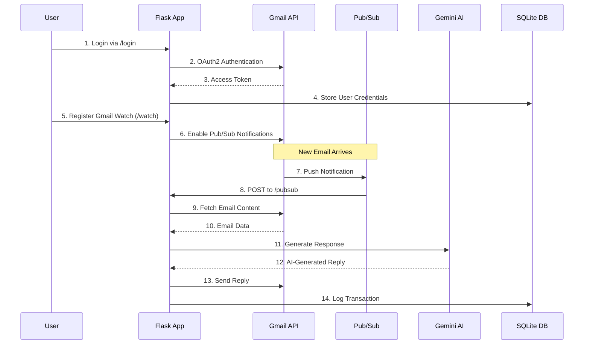

# Re:Gen - Intelligent Gmail Auto-Reply Assistant

<p align="center">
  
  
  
  
  
</p>

Re:Gen is an intelligent Gmail auto-reply assistant that leverages Google Cloud's Pub/Sub for real-time email monitoring and Google's Gemini AI for generating contextually appropriate responses. The system provides multi-user support, session-based OAuth authentication, and comprehensive logging capabilities.

## 🚀 Features

- **📩 Real-time Gmail Detection**: Uses Google Cloud Pub/Sub push notifications for instant email alerts
- **🧠 AI-Powered Responses**: Generates intelligent replies using Google's Gemini Pro model
- **👤 Multi-User Support**: Handles multiple Gmail accounts with individual OAuth credentials
- **🗃️ Database Storage**: SQLite database for user credentials, email logs, and metadata
- **🛠️ Web Interface**: Flask-based web server for managing Gmail watch registration and token refresh
- **📂 Session Management**: Maintains user sessions and response generation history
- **🔒 Secure Authentication**: OAuth2-based Gmail authentication with token refresh capabilities

## 🏗️ Architecture

```
┌─────────────────┐    ┌─────────────────┐    ┌─────────────────┐
│   Gmail API     │    │   Google Cloud  │    │   Flask App     │
│                 │    │     Pub/Sub     │    │                 │
│ ┌─────────────┐ │    │ ┌─────────────┐ │    │ ┌─────────────┐ │
│ │ New Email   │ │────▶│ │Push Notif.  │ │────▶│ │ /pubsub     │ │
│ │ Detected    │ │    │ │             │ │    │ │ Endpoint    │ │
│ └─────────────┘ │    │ └─────────────┘ │    │ └─────────────┘ │
└─────────────────┘    └─────────────────┘    └─────────────────┘
                                                        │
                                                        ▼
┌─────────────────┐    ┌─────────────────┐    ┌─────────────────┐
│   SQLite DB     │    │   Gemini API    │    │   Gmail API     │
│                 │    │                 │    │                 │
│ ┌─────────────┐ │    │ ┌─────────────┐ │    │ ┌─────────────┐ │
│ │Store Logs   │ │◀───│ │Generate     │ │────▶│ │Send Reply   │ │
│ │& Metadata   │ │    │ │Response     │ │    │ │             │ │
│ └─────────────┘ │    │ └─────────────┘ │    │ └─────────────┘ │
└─────────────────┘    └─────────────────┘    └─────────────────┘
```

## 🛠️ Tech Stack

| Layer | Technology |
|-------|------------|
| **Language** | Python 3.10+ |
| **Web Framework** | Flask |
| **Database** | SQLite3 |
| **Google Integration** | Gmail API, Google Cloud Pub/Sub, OAuth2 |
| **AI Model** | Gemini Pro (via Google Generative AI SDK) |
| **Deployment** | Localhost (extendable to Cloud Run/App Engine) |

## 📁 Project Structure

```
re-gen/
├── creds/                  # OAuth2 credentials per user
├── logs/                   # Application logs
├── static/                 # Static HTML files for status pages
├── templates/              # Jinja2 HTML templates for routes
├── .env                    # Environment variables (create from .env.example)
├── .env.example           # Environment variables template
├── app.py                 # Main Flask application with Pub/Sub and AI logic
├── db.py                  # SQLite database setup and query functions
├── gemini_utils.py        # Gemini API wrapper and utilities
├── gmail_utils.py         # Gmail API functions for fetch/reply operations
├── oauth.py               # OAuth2 flow and user authentication
├── pubsub_utils.py        # Google Cloud Pub/Sub handling
├── requirements.txt       # Python dependencies
├── README.md             # Project documentation
└── LICENSE               # MIT License
```

## 🔧 Installation & Setup

### Prerequisites

- Python 3.10 or higher
- Google Cloud Project with enabled APIs:
  - Gmail API
  - Google Cloud Pub/Sub API
- Google Generative AI API key (Gemini)
- OAuth2 credentials for Gmail

### Step 1: Clone Repository

```bash
git clone https://github.com/Nirvisha82/re-gen.git
cd re-gen
```

### Step 2: Create Virtual Environment

```bash
# Create virtual environment
python -m venv .venv

# Activate virtual environment
# On Linux/macOS:
source .venv/bin/activate

# On Windows:
.\.venv\Scripts\activate
```

### Step 3: Install Dependencies

```bash
pip install -r requirements.txt
```

### Step 4: Environment Configuration

1. Copy the environment template:
```bash
cp .env.example .env
```

2. Configure the `.env` file with your credentials:
```env
# Flask Configuration
FLASK_SECRET_KEY=your_super_secret_key_here

# Google OAuth2 Credentials
GOOGLE_CLIENT_ID=xxxxxxxxxxxxxxxxxxxx.apps.googleusercontent.com
GOOGLE_CLIENT_SECRET=xxxxxxxxxxxxxxxxxxxxxxxxx

# Gemini AI API Key
GEMINI_API_KEY=your_gemini_api_key_here

# Gmail Watch Configuration
WATCH_EXPIRY_TIME=604800  # 7 days in seconds
```

**📝 Getting API Keys:**
- **Gemini API Key**: Visit [Google AI Studio](https://makersuite.google.com/app/apikey)
- **Google OAuth2 Credentials**: [Google Cloud Console](https://console.cloud.google.com/apis/credentials)

### Step 5: Initialize Database

```bash
python db.py
```

This creates `regen.db` in the root directory with the required tables.

### Step 6: Run Application

```bash
python app.py
```

The application will be accessible at `http://localhost:5000`

## 📊 Database Schema

### Users Table
| Column | Type | Description |
|--------|------|-------------|
| `id` | INTEGER | Primary key (auto-increment) |
| `email` | TEXT | User's Gmail address (unique) |
| `token_json` | TEXT | Serialized OAuth2 credentials |

### Email Logs Table
| Column | Type | Description |
|--------|------|-------------|
| `id` | INTEGER | Primary key (auto-increment) |
| `email` | TEXT | User's email address |
| `thread_id` | TEXT | Gmail conversation thread ID |
| `message_id` | TEXT | Specific message ID |
| `received_at` | TEXT | Timestamp of email reception |
| `prompt` | TEXT | Input prompt sent to Gemini |
| `reply` | TEXT | Generated response from Gemini |

## 🔄 System Workflow



## 🌐 API Endpoints

| Route | Method | Description | Parameters |
|-------|--------|-------------|------------|
| `/` | GET | Home page and system status | None |
| `/login` | GET | Initiate OAuth2 Gmail authentication | None |
| `/oauth2callback` | GET | OAuth2 redirect URI for token exchange | `code`, `state` |
| `/watch` | GET | Register Gmail watch notifications | Requires authentication |
| `/pubsub` | POST | Handle Pub/Sub push notifications | JSON payload |
| `/send_reply` | POST | Internal endpoint for sending replies | Email data |

### Example API Usage

**Starting Gmail Watch:**
```bash
curl -X GET "http://localhost:5000/watch" \
  -H "Cookie: session=your_session_cookie"
```

**Pub/Sub Webhook (Internal):**
```bash
curl -X POST "http://localhost:5000/pubsub" \
  -H "Content-Type: application/json" \
  -d '{"message": {"data": "base64_encoded_notification"}}'
```

## 🤖 AI Response Generation

### Prompt Template
The system uses the following template for generating responses:

```
You are a helpful AI assistant. Write a concise and professional reply to the following email:

{EMAIL_CONTENT}
```

### Gemini Configuration
- **Model**: Gemini Pro
- **Temperature**: Optimized for professional responses
- **Max Tokens**: Configured for concise replies
- **Safety Settings**: Enabled for appropriate content filtering

## 🧪 Testing the System

### Local Testing Steps

1. **Start the Application:**
```bash
python app.py
```

2. **Authenticate:**
   - Navigate to `http://localhost:5000/login`
   - Complete Gmail OAuth2 flow

3. **Register Watch:**
   - Visit `http://localhost:5000/watch`
   - Confirm successful registration

4. **Test Email Processing:**
   - Send a test email to your authenticated Gmail account
   - Monitor logs for processing confirmation
   - Check for auto-generated reply

### Debugging Tips

```bash
# Check database entries
sqlite3 regen.db "SELECT * FROM users;"
sqlite3 regen.db "SELECT * FROM email_logs ORDER BY received_at DESC LIMIT 5;"

# Monitor application logs
tail -f logs/app.log  # If logging to file

# Test Pub/Sub connectivity
# Ensure your ngrok/public URL is configured in Google Cloud Console
```

## ⚙️ Configuration Options

### Gmail Watch Settings
- **Watch Duration**: 7 days (configurable via `WATCH_EXPIRY_TIME`)
- **Labels**: Currently monitors `INBOX` label
- **History Types**: `messageAdded`

### Gemini AI Settings
- **Model Version**: `gemini-pro`
- **Response Length**: Configured for concise professional replies
- **Content Filtering**: Enabled for appropriate business communication

### Security Considerations
- OAuth2 tokens are encrypted in database storage
- Session-based authentication with secure cookies
- Environment variables for sensitive configuration
- Input validation for all API endpoints

## 🚀 Deployment Options

### Local Development
```bash
python app.py  # Development server on localhost:5000
```

### Production Deployment

**Google Cloud Run:**
```bash
# Build container
docker build -t gcr.io/YOUR_PROJECT/re-gen .

# Deploy to Cloud Run
gcloud run deploy re-gen \
  --image gcr.io/YOUR_PROJECT/re-gen \
  --platform managed \
  --region us-central1 \
  --allow-unauthenticated
```

**Google App Engine:**
```yaml
# app.yaml
runtime: python310
service: re-gen

env_variables:
  FLASK_SECRET_KEY: "your_production_secret"
  GOOGLE_CLIENT_ID: "your_client_id"
  GOOGLE_CLIENT_SECRET: "your_client_secret"
  GEMINI_API_KEY: "your_gemini_key"
```

## 🔍 Monitoring & Logging

### Application Metrics
- Email processing count
- Response generation latency
- OAuth token refresh success rate
- Database operation performance

### Log Analysis
```bash
# View recent email processing
grep "Email processed" logs/app.log | tail -10

# Monitor OAuth operations
grep "OAuth" logs/app.log | tail -5

# Check Gemini API usage
grep "Gemini" logs/app.log | tail -10
```

## ⚠️ Known Limitations

- **Gmail Watch Expiry**: Expires every 7 days, requires re-registration
- **Session Management**: Currently uses basic session-based authentication
- **Email Format**: Only supports plain-text email processing
- **Gemini Quotas**: Subject to Google API rate limits and quotas
- **Concurrent Users**: No current limit on concurrent user sessions

## 🔮 Future Enhancements

### Planned Features
- **📱 Web Dashboard**: Complete user interface for account management
- **🏷️ Gmail Filters**: Response only to emails with specific labels
- **🎨 Response Customization**: User-defined response tones and templates
- **🔄 Multiple AI Models**: Support for different Gemini model variants
- **📊 Analytics**: Detailed usage statistics and performance metrics
- **🔔 Notifications**: Email/SMS alerts for system events

### Technical Improvements
- **🔒 Enhanced Security**: JWT-based authentication
- **📈 Scalability**: Redis for session management and caching
- **🐳 Containerization**: Complete Docker deployment setup
- **🧪 Testing**: Comprehensive unit and integration test suite
- **📝 Rich Text**: HTML email content processing

## 🐛 Troubleshooting

### Common Issues

**1. OAuth Authentication Fails**
```bash
# Check redirect URI configuration
# Ensure http://localhost:5000/oauth2callback is in Google Console
```

**2. Pub/Sub Notifications Not Received**
```bash
# Verify webhook URL accessibility
# Check Google Cloud Console Pub/Sub logs
# Ensure watch registration is active
```

**3. Gemini API Errors**
```bash
# Verify API key validity
# Check quota limits in Google AI Studio
# Monitor API usage in cloud console
```

**4. Database Connection Issues**
```bash
# Recreate database
rm regen.db
python db.py
```

## 📄 License

This project is licensed under the MIT License. See the [LICENSE](LICENSE) file for details.

## 👥 Contributors

- **[Nirvisha Soni](https://github.com/Nirvisha82)** - Lead Developer
- **[Neel Malwatkar](https://github.com/neelmalwatkar)** - Backend Developer  
- **[Anuj Gawde](https://github.com/anujgawde)** - System Integration

## 🤝 Contributing

1. Fork the repository
2. Create a feature branch (`git checkout -b feature/amazing-feature`)
3. Commit your changes (`git commit -m 'Add amazing feature'`)
4. Push to the branch (`git push origin feature/amazing-feature`)
5. Open a Pull Request

## 📞 Support

For support and questions:
- Create an issue on [GitHub Issues](https://github.com/Nirvisha82/re-gen/issues)
- Check existing documentation in the repository
- Review the troubleshooting section above

## 🙏 Acknowledgments

- Google Cloud Platform for robust API services
- Google Generative AI team for Gemini Pro
- Flask community for excellent web framework
- Open source contributors and maintainers

---

<p align="center">
  Made with ❤️ by the Re:Gen Team
</p>

<p align="center">
  <a href="https://github.com/Nirvisha82/re-gen">⭐ Star this repository if you found it helpful!</a>
</p>
